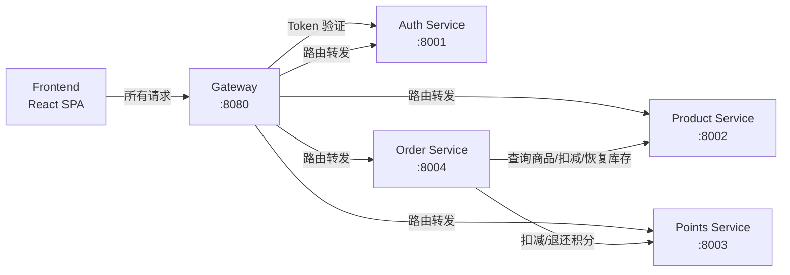

# 组件依赖关系

## 服务间依赖



文本替代：

```
Frontend → Gateway → Auth Service（Token 验证 + 路由）
Gateway → Product Service（路由）
Gateway → Points Service（路由）
Gateway → Order Service（路由）
Order Service → Points Service（扣减/退还积分）
Order Service → Product Service（查询商品/扣减/恢复库存）
```

## 依赖矩阵

| 服务 | 依赖的服务 | 依赖类型 | 依赖原因 |
|------|-----------|---------|---------|
| Frontend | Gateway | HTTP | 所有 API 请求通过 Gateway |
| Gateway | Auth Service | HTTP (WebClient) | JWT Token 验证 |
| Order Service | Points Service | HTTP (WebClient) | 兑换时扣减/退还积分 |
| Order Service | Product Service | HTTP (WebClient) | 兑换时查询商品/扣减/恢复库存 |
| Auth Service | 无 | — | 独立服务 |
| Product Service | 无 | — | 独立服务 |
| Points Service | 无 | — | 独立服务 |

## 服务内组件依赖（DDD 分层）

每个后端服务内部遵循统一的依赖方向：

```
interface-http → application-api ← application-impl → domain-api ← domain-impl → repository-api/cache-api/mq-api/security-api
                                                                                        ↑
                                                                              infrastructure 实现层
```

### Auth Service 内部

```
AuthController → AuthApplicationService → AuthenticationDomainService → JwtSecurityService (Port)
                                        → UserDomainService → UserRepository (Port)
                                                             → LoginAttemptCache (Port → Redis)
TokenValidateController → TokenValidationApplicationService → AuthenticationDomainService
UserController → UserApplicationService → UserDomainService
```

### Product Service 内部

```
ProductController → ProductApplicationService → ProductDomainService → ProductRepository (Port)
CategoryController → CategoryApplicationService → CategoryDomainService → CategoryRepository (Port)
InternalProductController → ProductApplicationService → ProductDomainService（库存扣减/恢复）
```

### Points Service 内部

```
PointsController → PointsApplicationService → PointsAccountDomainService → PointsAccountRepository (Port)
                                             → PointsTransactionDomainService → PointsTransactionRepository (Port)
InternalPointsController → PointsApplicationService（扣减/退还/发放）
```

### Order Service 内部

```
OrderController → OrderApplicationService → OrderDomainService → OrderRepository (Port)
RedeemController → RedemptionApplicationService → OrderDomainService
                                                → PointsServiceClient (HTTP)
                                                → ProductServiceClient (HTTP)
                                                → CompensationHandler (Redis 队列)
```

## 数据流

### 兑换下单数据流

```
1. Frontend POST /api/v1/order/redeem {productId, quantity}
2. Gateway → 验证 Token → 注入 operatorId → 转发到 Order Service
3. Order Service:
   a. HTTP GET → Product Service: 获取商品信息（价格、库存、状态）
   b. HTTP POST → Points Service: 扣减积分
   c. HTTP POST → Product Service: 扣减库存
   d. 本地事务: 创建订单记录
   e. 任一步骤失败 → 补偿（退还积分/恢复库存）
4. 返回订单信息 → Gateway → Frontend
```

### 订单取消数据流

```
1. Frontend POST /api/v1/order/cancel {orderId}
2. Gateway → 验证 Token → 注入 operatorId → 转发到 Order Service
3. Order Service:
   a. 校验订单状态（PENDING/PROCESSING 可取消）
   b. 校验权限（员工只能取消自己的订单）
   c. HTTP POST → Points Service: 退还积分
   d. HTTP POST → Product Service: 恢复库存
   e. 本地事务: 更新订单状态为 CANCELLED
4. 返回成功 → Gateway → Frontend
```
