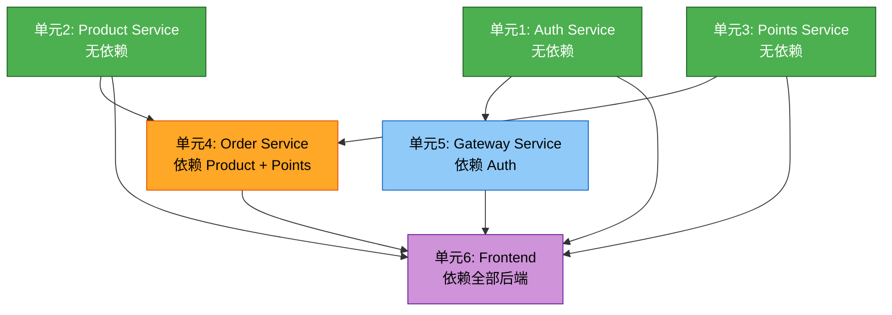

# 工作单元依赖关系

## 依赖图



文本替代：

```
第1批（并行）：Auth Service、Product Service、Points Service — 无外部依赖
第2批：Order Service — 依赖 Product + Points
第3批：Gateway Service — 依赖 Auth（小优化）
第4批：Frontend — 依赖全部后端服务
```

## 依赖矩阵

| 单元 | 依赖的单元 | 依赖类型 | 可并行 |
|------|-----------|---------|--------|
| unit-auth | 无 | — | ✅ 可独立开发 |
| unit-product | 无 | — | ✅ 可独立开发 |
| unit-points | 无 | — | ✅ 可独立开发 |
| unit-order | unit-product, unit-points | HTTP 调用 | ❌ 需等待 Product + Points |
| unit-gateway | unit-auth | HTTP 调用 | ⚠️ 需 Auth Token 验证端点 |
| unit-frontend | 全部后端单元 | HTTP 调用 | ❌ 需等待全部后端 |

## 推荐执行顺序

```
批次1: unit-auth + unit-product + unit-points （并行开发）
  ↓
批次2: unit-order （依赖批次1完成）
  ↓
批次3: unit-gateway （小优化，可与批次2并行）
  ↓
批次4: unit-frontend （依赖全部后端就绪）
```

## 集成测试检查点

| 检查点 | 时机 | 验证内容 |
|--------|------|---------|
| CP-1 | Auth 完成后 | Gateway → Auth Token 验证链路 |
| CP-2 | Product + Points 完成后 | 各服务独立 API 功能 |
| CP-3 | Order 完成后 | 兑换全链路（Order → Points + Product） |
| CP-4 | Frontend 完成后 | 端到端全流程验证 |
