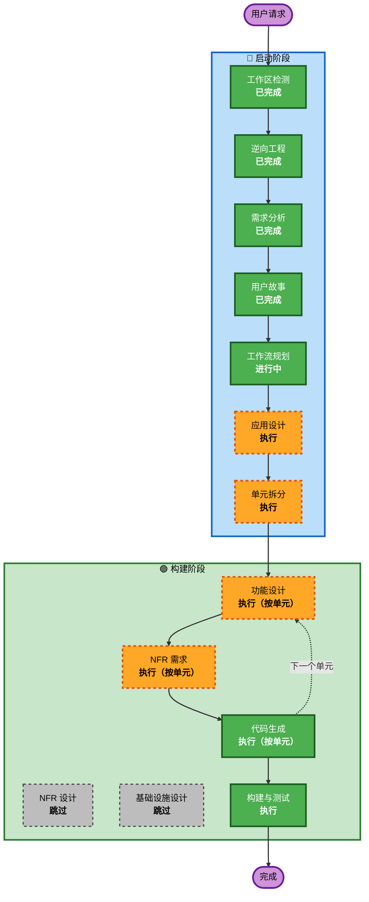

# 执行计划

## 详细分析摘要

### 变更范围

- **变更类型**：架构级变更（多服务新增业务逻辑 + 前端全栈对接）
- **主要变更**：4 个后端服务实现业务逻辑 + 前端对接 API 并补全页面
- **涉及组件**：auth-service、product-service、points-service、order-service、gateway-service、frontend（全部 6 个仓库）

### 变更影响评估

- **用户侧变更**：是 — 员工和管理员的全部交互流程
- **结构性变更**：是 — 新增领域模型、领域服务、应用服务、控制器、数据库表
- **数据模型变更**：是 — 新增用户表、积分账户表、积分交易表、订单表、分类表
- **API 变更**：是 — 新增约 30+ 个 API 端点
- **NFR 影响**：是 — 安全（JWT认证）、性能（乐观锁/Redis缓存）、测试（PBT）

### 组件关系

```
Frontend (React SPA)
    ↓ HTTP
Gateway (:8080) ──Token验证──→ Auth Service (:8001)
    ↓ 路由转发
    ├── Product Service (:8002)
    ├── Points Service (:8003)
    └── Order Service (:8004)
            ├──调用──→ Points Service（扣减/退还积分）
            └──调用──→ Product Service（扣减/恢复库存）
```

### 风险评估

- **风险等级**：中等
- **回滚复杂度**：中等（每个服务独立部署，可逐个回滚）
- **测试复杂度**：复杂（跨服务事务需要集成测试）

---

## 工作流可视化



文本替代：

```
启动阶段：工作区检测(已完成) → 逆向工程(已完成) → 需求分析(已完成) → 用户故事(已完成) → 工作流规划(进行中) → 应用设计(执行) → 单元拆分(执行)
构建阶段：功能设计(按单元执行) → NFR需求(按单元执行) → [NFR设计(跳过)] → [基础设施设计(跳过)] → 代码生成(按单元执行) → 构建与测试(执行)
```

---

## 阶段执行计划

### 🔵 启动阶段

- [x] 工作区检测（已完成）
- [x] 逆向工程（已完成）
- [x] 需求分析（已完成）
- [x] 用户故事（已完成）
- [x] 工作流规划（进行中）
- [ ] **应用设计 — 执行**
  - **理由**：需要定义 Auth/Points/Order 三个服务的新组件、领域服务方法、服务间调用关系；Product 服务需要新增分类组件
- [ ] **单元拆分 — 执行**
  - **理由**：系统涉及 6 个服务、41 个用户故事，需要拆分为可独立实施的工作单元，明确依赖顺序

### 🟢 构建阶段（按单元循环）

- [ ] **功能设计 — 执行（按单元）**
  - **理由**：每个单元有新的数据模型、业务规则、API 设计需要详细定义
- [ ] **NFR 需求 — 执行（按单元）**
  - **理由**：安全扩展（SECURITY-01~15）和 PBT 扩展（PBT-01~10）已启用，需要评估每个单元的 NFR 需求并选择测试框架
- [ ] **NFR 设计 — 跳过**
  - **理由**：NFR 模式（JWT、乐观锁、Redis 缓存）已在现有架构中确定，无需额外的 NFR 设计阶段
- [ ] **基础设施设计 — 跳过**
  - **理由**：基础设施（MySQL、Redis、Spring Boot）已就绪，无新增基础设施服务需要映射
- [ ] **代码生成 — 执行（按单元，始终执行）**
  - **理由**：每个单元需要规划 + 生成代码
- [ ] **构建与测试 — 执行（始终执行）**
  - **理由**：所有单元完成后需要构建指令和测试指令

### 🟡 运维阶段

- [ ] 运维 — 占位（未来扩展）

---

## 模块更新顺序

基于服务间依赖关系，推荐以下更新顺序：

```
第1批：Auth Service（无依赖，其他服务依赖它）
    ↓
第2批：Product Service + Points Service（并行，互不依赖）
    ↓
第3批：Order Service（依赖 Product + Points）
    ↓
第4批：Gateway Service（小优化，依赖 Auth 的 validate 端点）
    ↓
第5批：Frontend（依赖所有后端 API 就绪）
```

---

## 成功标准

- **主要目标**：实现积分兑换核心闭环 + 管理后台完整功能
- **关键交付物**：
  - Auth 服务：注册/登录/Token验证/用户管理
  - Product 服务：完整 CRUD + 分类管理 + 库存管理
  - Points 服务：积分账户/交易/发放/扣减/退还
  - Order 服务：兑换下单/状态流转/取消退还
  - Frontend：全部员工端和管理端页面对接真实 API
- **质量门禁**：
  - 核心业务逻辑单元测试覆盖
  - 关键 API 集成测试
  - PBT 属性测试（jqwik + fast-check）
  - Security Baseline 15 条规则合规
