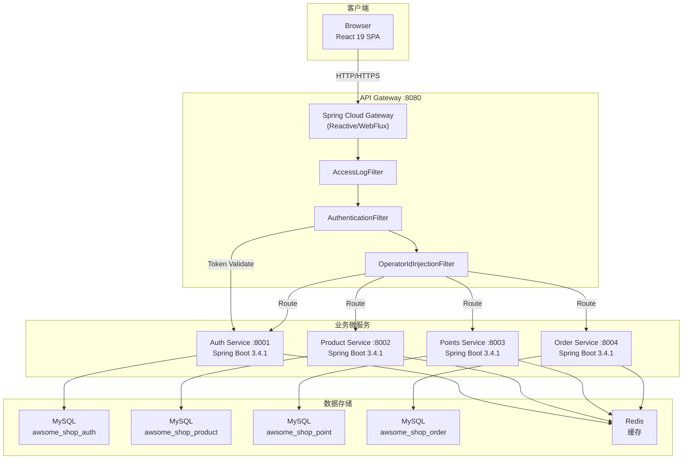
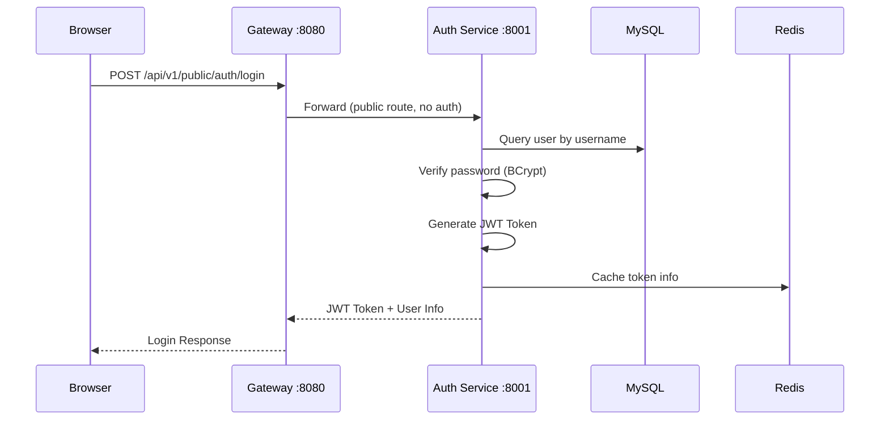
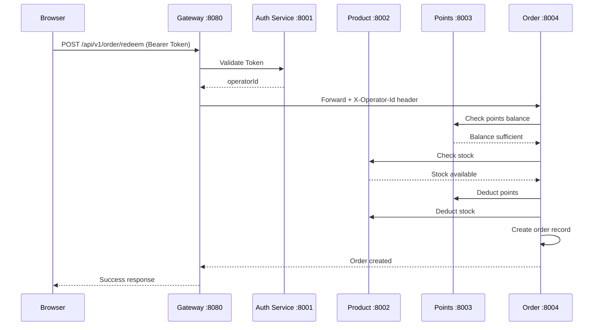

# System Architecture

## System Overview

AWSome Shop 是一个基于微服务架构的企业员工积分兑换商城。系统采用 DDD（领域驱动设计）+ 六边形架构模式，通过 API Gateway 统一入口，前端 React SPA 通过 Gateway 访问后端 4 个业务微服务。

## Architecture Diagram

## Component Descriptions

### Frontend (React SPA)

- **Purpose**: 用户交互界面，提供员工商城和管理后台
- **Responsibilities**: 页面渲染、路由鉴权、状态管理、API 调用
- **Dependencies**: API Gateway
- **Type**: Application (Frontend)

### Gateway Service

- **Purpose**: API 统一入口，请求路由和安全拦截
- **Responsibilities**: 路由转发、JWT 验证、操作员 ID 注入、访问日志、CORS
- **Dependencies**: Auth Service (token validation)
- **Type**: Application (Infrastructure Gateway)

### Auth Service

- **Purpose**: 用户认证和授权
- **Responsibilities**: 用户管理、JWT Token 生命周期、密码安全
- **Dependencies**: MySQL, Redis
- **Type**: Application (Business Service)

### Product Service

- **Purpose**: 商品目录管理
- **Responsibilities**: 商品 CRUD、库存管理、分类管理
- **Dependencies**: MySQL, Redis
- **Type**: Application (Business Service)

### Points Service

- **Purpose**: 积分管理
- **Responsibilities**: 积分余额、积分交易、积分发放
- **Dependencies**: MySQL, Redis
- **Type**: Application (Business Service)

### Order Service

- **Purpose**: 订单管理
- **Responsibilities**: 订单创建、状态流转、兑换记录
- **Dependencies**: MySQL, Redis
- **Type**: Application (Business Service)

## Data Flow

### 用户登录流程

### 商品兑换流程 (目标流程)

## Integration Points

- **External APIs**: 无（当前为独立系统）
- **Databases**: MySQL 8.4（每个服务独立数据库，通过 Flyway 管理迁移）
- **Third-party Services**: AWS SQS（已定义接口，尚未实现）

## Infrastructure Components

- **Deployment Model**: 本地开发环境（Docker MySQL + 本地 Redis + 各服务独立启动）
- **Build System**: Maven 多模块项目（每个服务 26 个子模块）
- **Monitoring**: Micrometer Tracing + Prometheus metrics（/actuator/prometheus）
- **API Documentation**: SpringDoc OpenAPI 2.7.0 + Swagger UI（Gateway 聚合所有服务文档）
