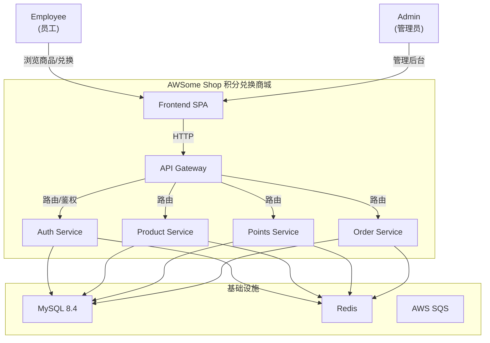

# Business Overview

## Business Context Diagram

## Business Description

- **Business Description**: AWSome Shop 是一个企业内部员工积分兑换商城系统。企业为员工发放积分作为奖励，员工可以使用积分在商城中兑换各类商品（数码电子、生活家居、美食餐饮、礼品卡券、办公用品等）。管理员负责商品上下架、积分发放、订单管理等后台运营工作。

- **Business Transactions**:
  1. **用户注册与登录** — 员工通过用户名密码注册和登录系统，获取 JWT Token 进行后续操作
  2. **商品浏览与搜索** — 员工浏览商城商品列表，按分类筛选，查看商品详情
  3. **积分兑换下单** — 员工使用积分兑换商品，系统扣减积分、扣减库存、创建订单
  4. **订单管理** — 员工查看兑换记录，管理员处理订单状态流转
  5. **积分管理** — 管理员为员工发放积分，员工查看积分余额和交易明细
  6. **商品管理** — 管理员进行商品的增删改查、上下架、库存管理
  7. **用户管理** — 管理员管理员工账号和角色

- **Business Dictionary**:

  | 术语 | 含义 |
  |------|------|
  | 积分 (Points) | 企业发放给员工的虚拟货币，用于兑换商品 |
  | 兑换 (Redemption) | 员工使用积分换取商品的行为 |
  | SKU | 商品唯一编号 (Stock Keeping Unit) |
  | 积分价格 (Points Price) | 兑换商品所需的积分数量 |
  | 市场参考价 (Market Price) | 商品的市场零售价格，供参考 |
  | 上架/下架 (On/Off Shelf) | 商品是否在商城中可见可兑换 |
  | 操作员ID (Operator ID) | 当前登录用户的唯一标识，由 Gateway 注入请求中 |

## Component Level Business Descriptions

### Auth Service (认证服务)

- **Purpose**: 负责用户身份认证和授权管理
- **Responsibilities**: 用户注册、登录、JWT Token 生成与验证、密码加密、登录限流防暴力破解

### Product Service (商品服务)

- **Purpose**: 管理商城中的所有可兑换商品
- **Responsibilities**: 商品 CRUD、分类管理、库存管理、商品上下架、SKU 唯一性校验

### Points Service (积分服务)

- **Purpose**: 管理员工积分的全生命周期
- **Responsibilities**: 积分余额查询、积分发放、积分扣减、积分交易记录

### Order Service (订单服务)

- **Purpose**: 处理积分兑换订单的完整生命周期
- **Responsibilities**: 订单创建、订单状态流转、兑换记录查询、订单取消

### Gateway Service (网关服务)

- **Purpose**: 统一的 API 入口，负责请求路由和安全拦截
- **Responsibilities**: 请求路由、JWT Token 验证、操作员 ID 注入、访问日志、CORS 处理、Swagger 文档聚合

### Frontend (前端)

- **Purpose**: 员工和管理员的 Web 操作界面
- **Responsibilities**: 员工商城浏览与兑换、管理员后台运营、双角色路由鉴权、国际化、主题切换
