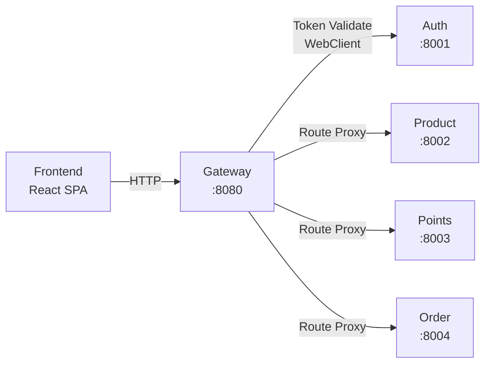
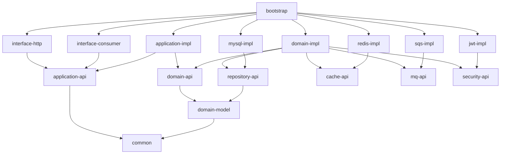

# Dependencies

## Internal Dependencies (Service Communication)

### Frontend depends on Gateway

- **Type**: Runtime (HTTP)
- **Reason**: 所有 API 请求通过 Gateway 路由

### Gateway depends on Auth Service

- **Type**: Runtime (HTTP - WebClient)
- **Reason**: JWT Token 验证需要调用 Auth Service 的 `/api/v1/internal/auth/validate`

### Gateway depends on All Backend Services

- **Type**: Runtime (HTTP Proxy)
- **Reason**: 路由转发请求到各业务服务

### 服务间直接通信 (未来)

- **Order → Points**: 兑换时扣减积分
- **Order → Product**: 兑换时扣减库存
- **通信方式**: 同步 HTTP 或异步 SQS (待实现)

## Module Dependencies (per service)

## External Dependencies

### Spring Boot Ecosystem

| Dependency | Version | Purpose | License |
|-----------|---------|---------|---------|
| spring-boot-starter-web | 3.4.1 | Web 框架 | Apache 2.0 |
| spring-boot-starter-data-redis | 3.4.1 | Redis 集成 | Apache 2.0 |
| spring-boot-starter-actuator | 3.4.1 | 监控端点 | Apache 2.0 |
| spring-cloud-starter-gateway | 2025.0.0 | API 网关 | Apache 2.0 |

### Data Access

| Dependency | Version | Purpose | License |
|-----------|---------|---------|---------|
| mybatis-plus-spring-boot3-starter | 3.5.7 | ORM | Apache 2.0 |
| druid-spring-boot-starter | 1.2.20 | 连接池 | Apache 2.0 |
| mysql-connector-j | 8.x | MySQL 驱动 | GPL 2.0 |
| flyway-core | - | DB 迁移 | Apache 2.0 |
| flyway-mysql | - | MySQL 方言 | Apache 2.0 |

### Security

| Dependency | Version | Purpose | License |
|-----------|---------|---------|---------|
| jjwt-api | 0.12.6 | JWT API | Apache 2.0 |
| jjwt-impl | 0.12.6 | JWT 实现 | Apache 2.0 |
| jjwt-jackson | 0.12.6 | JWT JSON | Apache 2.0 |

### AWS

| Dependency | Version | Purpose | License |
|-----------|---------|---------|---------|
| software.amazon.awssdk:sqs | 2.20.0 | SQS 客户端 | Apache 2.0 |

### Observability

| Dependency | Version | Purpose | License |
|-----------|---------|---------|---------|
| micrometer-tracing-bridge-brave | 1.3.5 | 分布式追踪 | Apache 2.0 |
| logstash-logback-encoder | 7.4 | 结构化日志 | Apache 2.0 |

### Documentation

| Dependency | Version | Purpose | License |
|-----------|---------|---------|---------|
| springdoc-openapi-starter-webmvc-ui | 2.7.0 | Swagger UI | Apache 2.0 |

### Utilities

| Dependency | Version | Purpose | License |
|-----------|---------|---------|---------|
| lombok | - | 代码简化 | MIT |
| jackson-databind | - | JSON 序列化 | Apache 2.0 |
